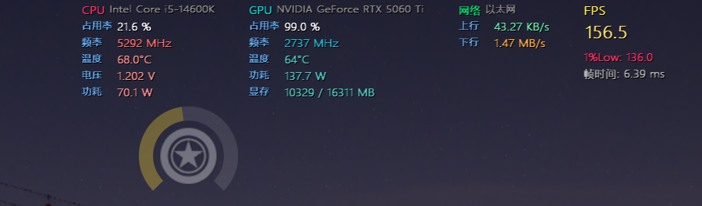
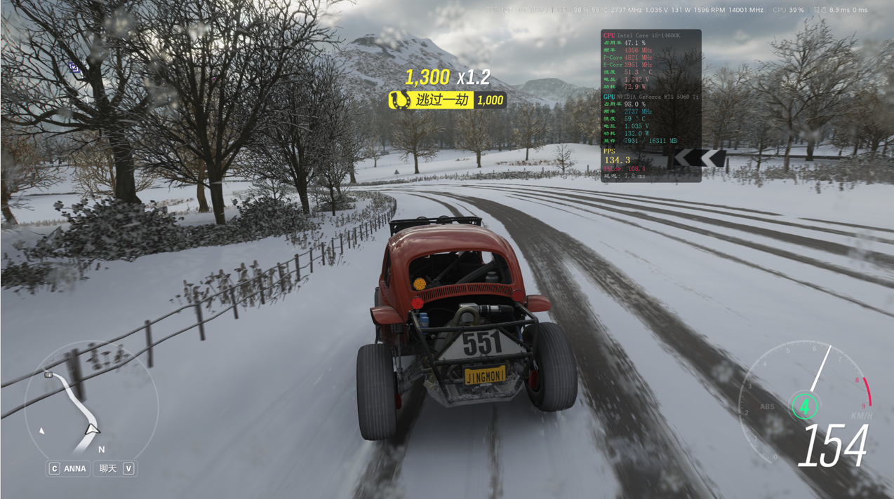
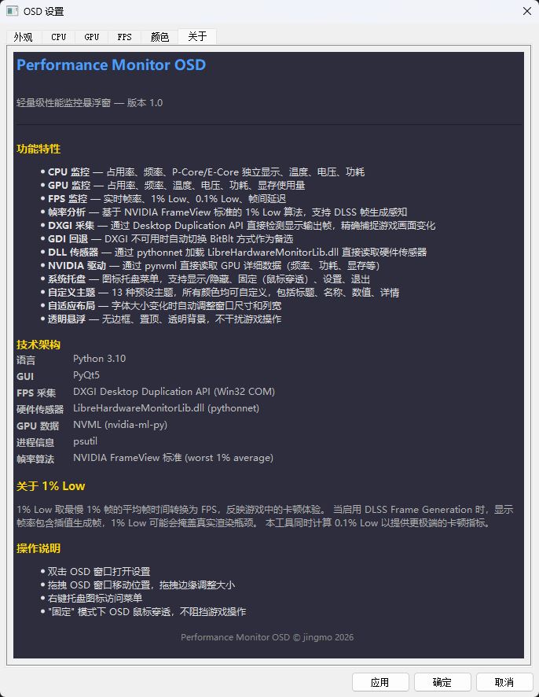

# 性能监控 OSD (Performance Monitor OSD)

[](LICENSE)
[](https://www.python.org/)
[]()

> 轻量级、可定制的实时硬件监控覆盖层，专为游戏玩家和性能调优专家设计。

性能监控 OSD 是一个基于 PyQt5 的桌面工具，以半透明覆盖层的形式显示 CPU、GPU 和 FPS 实时数据。它支持 1% Low FPS、帧时间分析、多种主题，并兼容 NVIDIA FrameView 算法，帮助您精准识别性能瓶颈。

 

---
info
## 目录

- [功能特性](#功能特性)
- [系统要求](#系统要求)
- [快速开始](#快速开始)
- [使用指南](#使用指南)
  - [界面操作](#界面操作)
  - [主题与自定义](#主题与自定义)
  - [FPS 采集方式](#fps-采集方式)
- [性能指标详解](#性能指标详解)
- [故障排除](#故障排除)
- [性能优化建议](#性能优化建议)
- [贡献指南](#贡献指南)
- [许可证](#许可证)
- [致谢](#致谢)

---

## 功能特性

### 📊 实时监控
- **CPU**：使用率、频率、温度、电压、功耗
- **GPU**：使用率、频率、温度、电压、功耗、显存占用
- **FPS**：平均帧率、1% Low、0.1% Low、帧时间中位数及标准差

### 🎮 游戏性能分析
- **1% Low / 0.1% Low**：反映真实体验卡顿情况
- **帧时间变异系数**：评估帧率稳定性（<5% 优秀，>10% 较差）
- **DLSS 支持**：可区分真实渲染帧与 DLSS 生成帧，便于分析 CPU 瓶颈

### 🎨 高度可定制
- **13+ 种色彩主题**（赛博朋克、暗夜、清新、霓虹等）
- **自由调整**字体大小、颜色、显示项目
- **可拖拽、缩放**覆盖层
- **固定模式**（窗口置顶但不阻挡点击）

### 🛠 采集方式灵活
- **DXGI 桌面复制**（首选，兼容 DirectX/Vulkan）
- **GDI BitBlt**（回退方案，适用于部分旧游戏）

### 🔧 系统托盘集成
- 显示/隐藏覆盖层
- 一键固定/取消固定
- 快速打开设置面板
- 系统信息查看

### ⚡ 性能优化
- CPU 占用 < 5%
- 更新间隔可调（100ms ~ 5000ms）
- 监控区域仅 64x64 像素，对游戏帧率影响极小

---

## 系统要求

- **操作系统**：Windows 10 / 11（64 位）
- **Python**：3.8 或更高版本
- **显卡**：DirectX 11 兼容（推荐用于 DXGI 采集）
- **依赖库**：PyQt5, psutil, nvidia-ml-py, pythonnet
- **硬件传感器**：需要 [LibreHardwareMonitor](https://github.com/LibreHardwareMonitor/LibreHardwareMonitor/releases) 的 DLL 文件

---

## 快速开始

### 1. 安装依赖
```bash
pip install PyQt5 psutil nvidia-ml-py pythonnet


### 2. 下载 LibreHardwareMonitor
- 从 [Releases 页面](https://github.com/LibreHardwareMonitor/LibreHardwareMonitor/releases) 下载最新版本。
- 解压后，将 `LibreHardwareMonitorLib.dll` 复制到与脚本相同的目录，或将其所在路径添加到系统 `PATH`。

### 3. 运行程序
```bash
python main.py
```

> **提示**：建议以**管理员权限**运行，以确保能够读取所有硬件传感器并正常采集 FPS。

---

## 使用指南

### 界面操作
- **双击 OSD**：打开设置面板
- **右键单击系统托盘图标**：快速控制（显示/隐藏、固定、退出）
- **拖动 OSD 边框**：调整窗口大小（需在设置中启用“可调整大小”）
- **按住 OSD 标题区域**：移动窗口位置

### 主题与自定义
在设置面板中，您可以：
- 选择预设主题（如 Cyberpunk、Dark Night、Fresh 等）
- 自定义文本颜色、背景透明度、字体大小
- 选择要显示的监控项（CPU/GPU/帧率等）
- 调整更新间隔（推荐 500ms 平衡性能与实时性）
- 切换采集方式（DXGI / GDI）

### FPS 采集方式
- **DXGI 桌面复制**：通过 Windows Desktop Duplication API 捕获屏幕更新，适用于大多数现代 DirectX 和 Vulkan 游戏，性能开销小。
- **GDI BitBlt**：基于 GDI 的屏幕截图方式，兼容性更广，但性能开销稍高，建议仅在 DXGI 不可用时使用。

您可以在设置中手动切换，程序也会在 DXGI 初始化失败时自动尝试 GDI。

---

## 性能指标详解

| 指标 | 说明 |
|------|------|
| **平均 FPS** | 统计周期内的平均帧率 |
| **1% Low FPS** | 对帧时间排序，取最差 1% 的帧，计算其平均 FPS。反映用户体验到的卡顿程度。 |
| **0.1% Low FPS** | 类似 1% Low，但取最差 0.1% 帧，对极端卡顿更敏感。 |
| **帧时间中位数** | 所有帧时间的中间值，代表典型帧耗时。 |
| **帧时间标准差** | 帧时间离散程度，越大表示帧率越不稳定。 |
| **变异系数 (CV)** | 标准差 / 平均值，用于评估稳定性（<5% 极稳，5-10% 可接受，>10% 需优化）。 |

> **DLSS 说明**：启用 DLSS 帧生成时，1% Low 反映的是**用户视觉体验**，而非 GPU 原始渲染能力。若想分析渲染瓶颈，建议关闭 DLSS 或启用“显示真实渲染帧”选项。

---

## 故障排除

### ❌ “LibreHardwareMonitorLib.dll not found”
- 确保 DLL 文件与 `main.py` 在同一目录。
- 或将该 DLL 所在目录添加到系统 `PATH` 环境变量中。

### ❌ “Permission denied” 或传感器无数据
- 以**管理员身份**运行程序。
- 检查杀毒软件是否阻止了硬件访问。

### ❌ 程序卡顿或 CPU 占用过高
- 在设置中增大“刷新间隔”（建议 500ms 以上）。
- 关闭其他同时监控硬件的软件（如 MSI Afterburner）。

### ❌ 游戏中掉帧明显
- 尝试降低更新间隔（如改为 1000ms）。
- 切换采集方式为 GDI（虽然性能稍差，但兼容性更好）。
- 缩小 OSD 窗口尺寸，减少绘制开销。

### ❌ 1% Low 数值异常偏高
- 可能开启了 DLSS 帧生成，此时 1% Low 反映视觉流畅度而非渲染性能。如需原始帧率，请关闭 DLSS。
- 检查采集方式是否正常工作，部分游戏可能不兼容 DXGI。

---

## 性能优化建议

- **调整刷新间隔**：游戏时推荐 500ms，桌面应用可设为 200ms。
- **选择合适采集方式**：优先尝试 DXGI，若不兼容再切 GDI。
- **减少显示项**：在设置中只保留您关注的指标，降低绘制负担。
- **固定窗口位置**：避免频繁重绘，有助于降低 CPU 使用。

---

## 贡献指南

欢迎任何形式的贡献！请遵循以下步骤：

1. Fork 本仓库。
2. 创建您的特性分支 (`git checkout -b feature/AmazingFeature`)。
3. 提交更改 (`git commit -m 'Add some AmazingFeature'`)。
4. 推送至分支 (`git push origin feature/AmazingFeature`)。
5. 开启一个 Pull Request。

请确保代码风格符合 PEP 8，并保持文档同步更新。

---

## 许可证

本项目基于 **MIT 许可证** 开源，详情请见 [LICENSE](LICENSE) 文件。

---

## 致谢

- [LibreHardwareMonitor](https://github.com/LibreHardwareMonitor/LibreHardwareMonitor) – 提供底层硬件传感器接口。
- [NVIDIA FrameView](https://www.nvidia.com/en-us/geforce/technologies/frameview/) – 算法参考。
- [CapFrameX](https://capframex.com/) – 1% Low 计算启发。
- 所有开源社区贡献者，使本项目更加稳定和易用。

---

**版本**：1.0  
**发布日期**：2026-07-28  
**作者**：[jingmo](https://github.com/Xyhshell)  
**项目地址**：[GitHub](https://github.com/Xyhshell/performance-monitor-osd)
